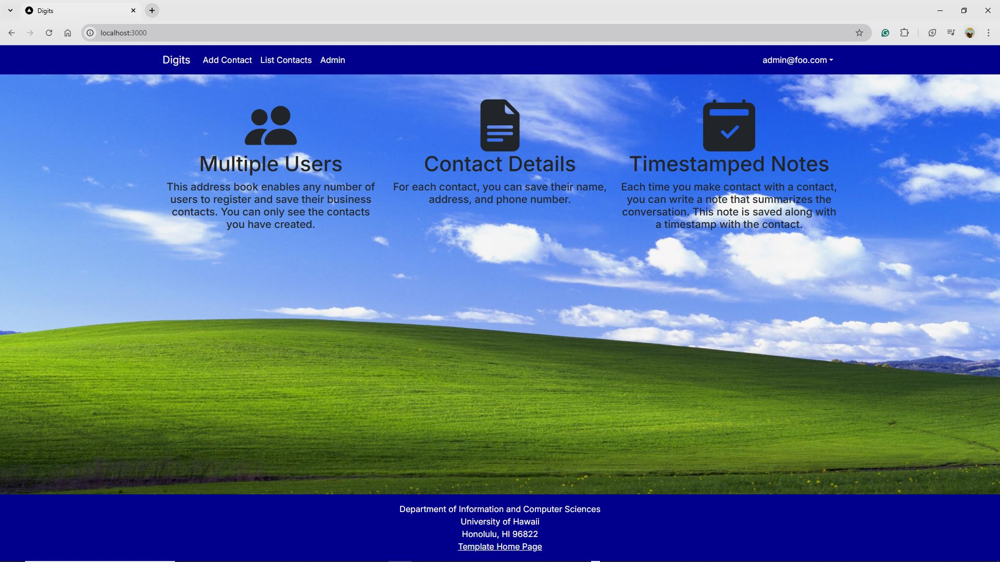
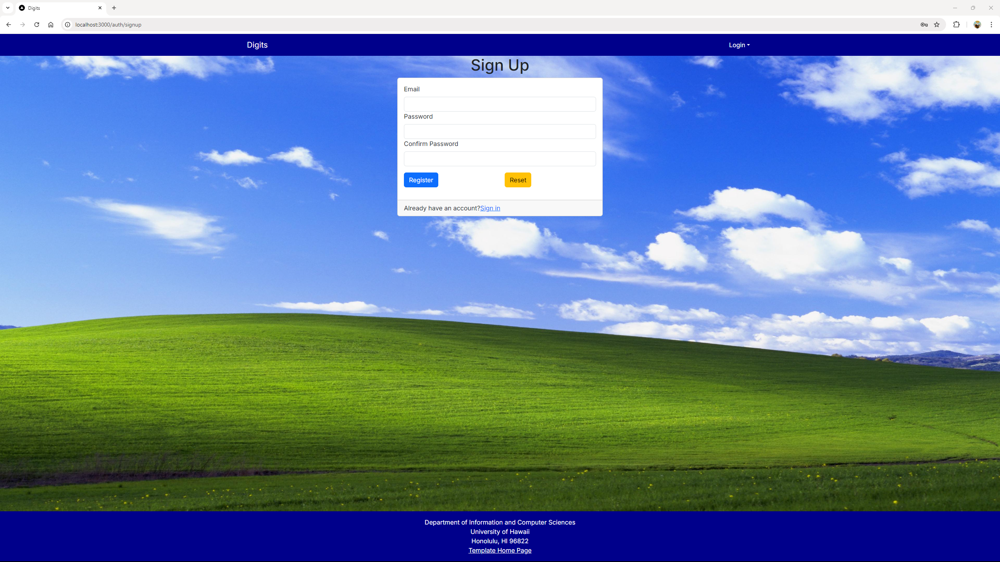
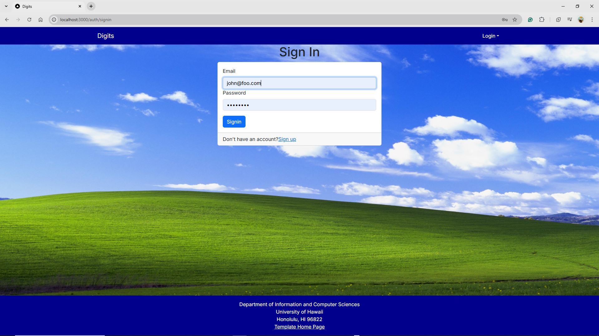

Digits is an application that allows users to:

- Register an account.
- Create and manage a set of contacts.
- Add a set of timestamped notes regarding their interactions with each contact.

## Installation

First, [download a copy of Digits](https://github.com/nwarias003/digits) 

Second, go to your newly created repository, and click the "Clone or download" button to download your new GitHub repo to your local file system. Using [GitHub Desktop](https://desktop.github.com/) is a great choice if you use MacOS or Windows.

Third, [install PostgreSQL](https://www.postgresql.org/download/). Then create a database for your application.

```

$ createdb -U postgres digits
Password:
$

```

Fourth, cd into the app directory and install the required libraries with:

```

$ npm install

```

Fifth, create a `.env` file from the `sample.env`. Set the `DATABASE_URL` variable to match your PostgreSQL database that you created in the first step. See the Prisma docs [Connect your database](https://www.prisma.io/docs/getting-started/setup-prisma/add-to-existing-project/relational-databases/connect-your-database-typescript-postgresql). Then run the Prisma migration `npx prisma migrate dev` to set up the PostgreSQL tables.

```

$ npx prisma migrate dev
Environment variables loaded from .env
Prisma schema loaded from prisma/schema.prisma
Datasource "db": PostgreSQL database "<your database name>", schema "public" at "localhost:5432"

Applying migration `20240708195109_init`

Applying migration `20240708195109_init`
Applying migration `20241106013956_contact`
Applying migration `20241110005057_note`
Applying migration `20241111220252_cleanup`

The following migration(s) have been applied:

migrations/
  └─ 20240708195109_init/
    └─ migration.sql
  └─ 20241106013956_contact/
    └─ migration.sql
  └─ 20241110005057_note/
    └─ migration.sql
  └─ 20241111220252_cleanup/
    └─ migration.sql

Your database is now in sync with your schema.

✔ Generated Prisma Client (v5.21.1) to .\node_modules\@prisma\client in 41ms

$

```

Then seed the database with the `/config/settings.development.json` data using `npx prisma db seed`.

```

$ npx prisma db seed
Environment variables loaded from .env
Running seed command `ts-node --compiler-options {"module":"CommonJS"} prisma/seed.ts` ...
Seeding the database
Creating user: admin@foo.com with role: ADMIN
Creating user: john@foo.com with role: USER
Adding contact: Philip Johnson
Adding contact: Henri Casanova
Adding contact: Kim Binsted


🌱 The seed command has been executed.
$

```

Once the libraries are installed and the database seeded, you can run the application by invoking the "dev" script in the [package.json file](https://github.com/nwarias003/digits/blob/main/package.json):

```

$ npm run dev

> nextjs-application-template-1@0.1.0 dev
> next dev

  ▲ Next.js 14.2.10
  - Local:        http://localhost:3000

 ✓ Starting...
 ✓ Ready in 2.5s

```

### Viewing the running app

If all goes well, the template application will appear at [http://localhost:3000](http://localhost:3000). You can login using the credentials in [settings.development.json](https://github.com/ics-software-engineering/nextjs-application-template/blob/main/config/settings.development.json), or else register a new account.

### ESLint

You can verify that the code obeys our coding standards by running ESLint over the code in the src/ directory with:

```
$ npm run lint

> nextjs-application-template-1@0.1.0 lint
> next lint

✔ No ESLint warnings or errors
$
```

## User Interface Walkthrough

The following sections describe the major features of this template.

### Landing Page

When you first bring up the application, you will see the landing page that provides a brief introduction to the capabilities of Digits:


Register
If you do not yet have an account on the system, you can register by clicking on “Login”, then “Sign Up”:



Sign in
Click on the Login link, then click on the Signin link to bring up the Sign In page which allows you to login:



User home page
After successfully logging in, the system takes you to your home page. It is just like the landing page, but the NavBar contains links to list contact and add new contacts:

